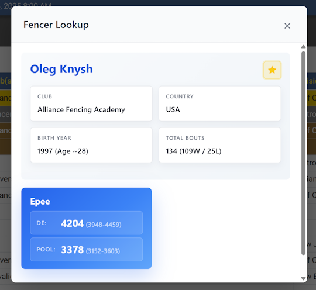
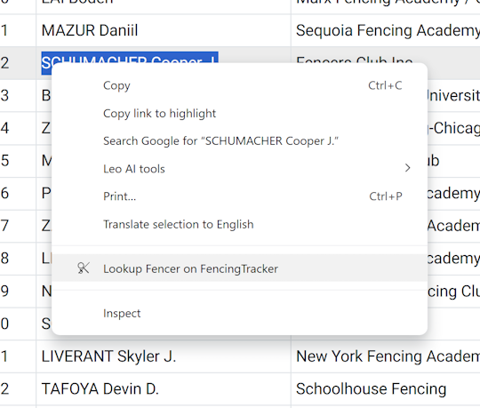
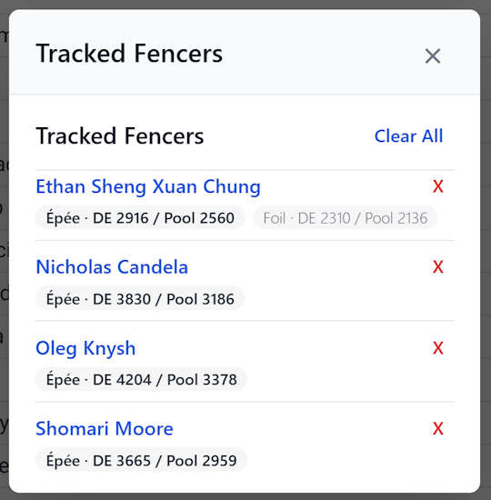

# Fencer Strength Lookup

**Instantly look up fencer strength ratings and stats from any webpage.**

This browser extension for Chrome, Firefox, and Edge lets you right-click a fencer's name on any website to instantly view their competitive profile, strength ratings, and win/loss record from FencingTracker.com.

Keep tabs on your favorite athletes by starring them for quick access, and see a summary of their skills across all three weapons.

## Features

-   **Instant Context Menu Lookup**: Highlight a name, right-click, and get immediate results.
-   **Detailed Profiles**: View fencer details including club, country, and birth year.
-   **Multi-Weapon Strength**: See DE and Pool strength ratings for Épée, Foil, and Saber.
-   **Win/Loss Records**: Access career bout statistics at a glance.
-   **Track Your Favorites**: Star fencers to add them to a quick-access list in the extension popup.
-   **Smart Name Recognition**: Works with formats like `"First Last"`, `"Last, First"`, and even nicknames.

## How to Use

1.  **Highlight a fencer's name** on any webpage.
2.  **Right-click** the selected text.
3.  Choose **"Lookup Fencer on FencingTracker"** from the context menu.

The extension will show a profile if it finds a single match or a list of options for multiple matches.

You can view your list of starred fencers at any time by clicking the extension icon in your browser toolbar.

## Installation

You can load this extension into any Chromium-based browser (like Chrome, Edge, or Brave).

### Option 1: Install from Release Zip (Recommended)

1.  Download the latest `fencer-strength-extension.zip` from the releases page.
2.  Extract the zip file to a permanent location on your computer.
    *   **Important:** Do not delete this folder after installation - Chrome needs it to run the extension.
3.  Open your browser and navigate to `chrome://extensions`.
4.  Enable **Developer mode** using the toggle in the top-right corner.
5.  Click **Load unpacked** and select the extracted folder.
6.  The Fencer Strength Lookup icon will appear in your browser toolbar.

You can verify the zip file's integrity using the included `.sha256` checksum file.

### Option 2: Install from Source (For Developers)

1.  Clone this repository to your computer.
2.  Open your browser and navigate to `chrome://extensions`.
3.  Enable **Developer mode** using the toggle in the top-right corner.
4.  Click **Load unpacked** and select the repository folder.
5.  The Fencer Strength Lookup icon will appear in your browser toolbar.

If you make changes to the code and want to distribute it, run `./scripts/package-extension.sh` to create a new release zip. This ensures all required files (including the `src/` helper modules needed by the service worker) are included in the archive.

## Privacy

This extension is designed with your privacy in mind:

-   It only activates when you use the context menu or click the toolbar icon.
-   It communicates exclusively with FencingTracker.com to retrieve fencer data.
-   No personal data is collected, stored, or shared. All tracked fencer information is saved locally on your computer.

---

**License**: MIT